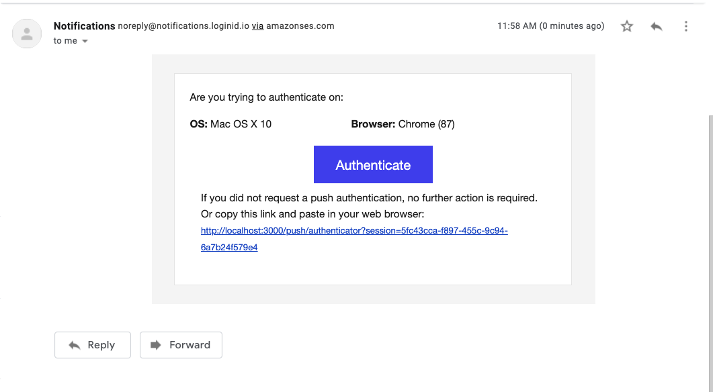

# push-auth-demo-fe

## Project setup

```
npm install
```

### Compiles and hot-reloads for development

```
npm run serve
```

### Setup Environment variables

Copy and rename `.env.example` to `.env`.

`PORT`, `VUE_APP_PUSH_AUTH_ENDPOINT` and `VUE_APP_ADD_AUTH_ENDPOINT` could be whatever route you want, but you need to input whatever you set in this environment file into the [loginID dashboard](https://sandbox-usw1.api.loginid.io/) during the process to obtian your BASE URL and API KEY.

* For further instructions on how to obtain BASE URL and API key on the DirectWeb integration, please refer to [here](https://docs.loginid.io/websdks/dw#step-1---obtain-your-client-keys)


. PLEASE NOTE YOU WILL NEED TO ACCESS THE DASHBOARD USING [loginID dashboard](https://sandbox-usw1.api.loginid.io/) 

example

```
PORT=3000
VUE_APP_PUSH_AUTH_ENDPOINT=/push/authenticator
VUE_APP_ADD_AUTH_ENDPOINT=/add/authenticator
```

### Compiles and minifies for production

```
npm run build
```

### Lints and fixes files

```
npm run lint
```

### Customize configuration

See [Configuration Reference](https://cli.vuejs.org/config/).

### How to test this (with screenshots)

#### Step 0. If you are doing two computer setups make sure you run two copies of this demo project with the exact same env variables.

It would be preferable if you test this on one computer, using two different fido2 enabled browsers:

* On MacOS: latest chrome, latest canary chrome and latest brave browser.

* On Windows: as long as the computer has Windows Hello enabled, all browsers should work.

#### Step 1. On your first computer (or first browser) go to [http://localhost:3000/login](http://localhost:3000/login)


Click on the register button and register a new account.


Register a user of your choosing, Lets just use john.doe for this example.


* You will be prompted to authenticate with an authenticator

* You should see Hello john.doe on the next screen.

#### Step 2. On your second computer (or second browser) go to [http://localhost:3000/login](http://localhost:3000/login)

* Input the same username used your first computer (or first browser) in my case john.doe.

* Input a transient email. _This field only exists for demo purposes_ in a real life environment the email would be sent to the email the user has on profile.

* Make sure you input an email you have access to on your first computer (or first browser).

To authenticate, press the `Push Authentication` button. You should see the following screen.


* Now go back to your first computer or first browser and check your inbox belongin to the transient email.



* Check spam folder if you didn't receive it within a few seconds.

* Clicking the link should send you to authenticate. Input your username as prompted


On your second computer and browser you should see the hello screen.


#### Step 3.Repeat step 2 but for add authenticator

The flow is the same, except at the end of the process you should be able to login on the second computer or the second browser by clicking on the login button, and the second browser would no longer neeed to use push authentication to authenticate.
